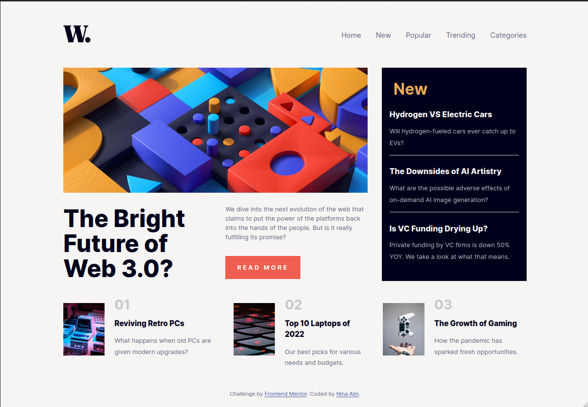

# Frontend Mentor - News homepage solution

This is a solution to the [News homepage challenge on Frontend Mentor](https://www.frontendmentor.io/challenges/news-homepage-H6SWTa1MFl). Frontend Mentor challenges help you improve your coding skills by building realistic projects. 

## Table of contents

- [Overview](#overview)
  - [The challenge](#the-challenge)
  - [Screenshot](#screenshot)
  - [Links](#links)
- [My process](#my-process)
  - [Built with](#built-with)
  - [What I learned](#what-i-learned)
  - [Continued development](#continued-development)
  - [Useful resources](#useful-resources)
- [Author](#author)
- [Acknowledgments](#acknowledgments)

## Overview

### The challenge

Users should be able to:

- View the optimal layout for the interface depending on their device's screen size
- See hover and focus states for all interactive elements on the page

### Screenshot




### Links

[Live Site URL](https://nina-alin.github.io/news-homepage-main/)

## My process

### Built with

- Semantic HTML5 markup
- SCSS
- Flexbox
- CSS Grid
- JavaScript

### What I learned

I've learned how to use CSS Flexbox and Grid properties. I've also learned how to use JavaScript to create a responsive navigation menu.

```html

To see how you can add code snippets, see below:

```html
<div id="sidenav" class="sidenav">
  <a href="javascript:void(0)" class="close_sidenav" onclick="closeNav()"></a>
  <div class="sidebar_link">
    <a href="#">Home</a>
    <a href="#">New</a>
    <a href="#">Popular</a>
    <a href="#">Trending</a>
    <a href="#">Categories</a>
  </div>
</div>
```

```scss
.sidenav {
  height: 100%;
  width: 0;
  position: fixed;
  z-index: 1;
  top: 0;
  right: 0;
  background-color: bases.$off-white;
  overflow-x: hidden;
  transition: 0.5s;
  padding-top: 15px;
  a {
    padding: 8px 8px 8px 32px;
    text-decoration: none;
    font-size: 18px;
    color: bases.$very-dark-blue ;
    display: block;
    transition: 0.3s;
    margin-top: 0.8rem;
    &:hover {
      color: bases.$soft-red;
    }
  }
  .close_sidenav {
    position: absolute;
    top: 0;
    right: 25px;
    font-size: 36px;
    margin-left: 50px;

    img {
      width: 90%;
    }
  }
}

.sidebar_link {
  margin-top: 7rem !important;
}
```
```js
function openNav() {
  document.getElementById("sidenav").style.width = "250px";
}

function closeNav() {
  document.getElementById("sidenav").style.width = "0";
}
```

### Continued development

I want to improve myself regarding my Grid and Flexbox skills. I also want to learn more about Vanilla JavaScript and how to use it to create more complex projects. I already have experiences in more complex JavaScript frameworks (React, NextJs, NestJs...) but my skills in Vanilla JavaScript are not as good as I would like them to be.

### Useful resources

- [W3Schools](https://www.w3schools.com/howto/howto_js_sidenav.asp) - I implemented the navigation menu from this website. It helped me understand how to create a responsive navigation menu using JavaScript.
- [CSS Tricks](https://css-tricks.com/snippets/css/complete-guide-grid/) - This website helped me a lot to understand how to use CSS Grids.

## Author

- Gitlab - [ninaalin](https://www.your-site.com)
- Frontend Mentor - [@nina-alin](https://www.frontendmentor.io/profile/nina-alin)
- Twitter - [@karmirariel](https://www.twitter.com/karmirariel)

## Acknowledgments

Thank you to Frontend Mentor for this challenge. It was a great experience!